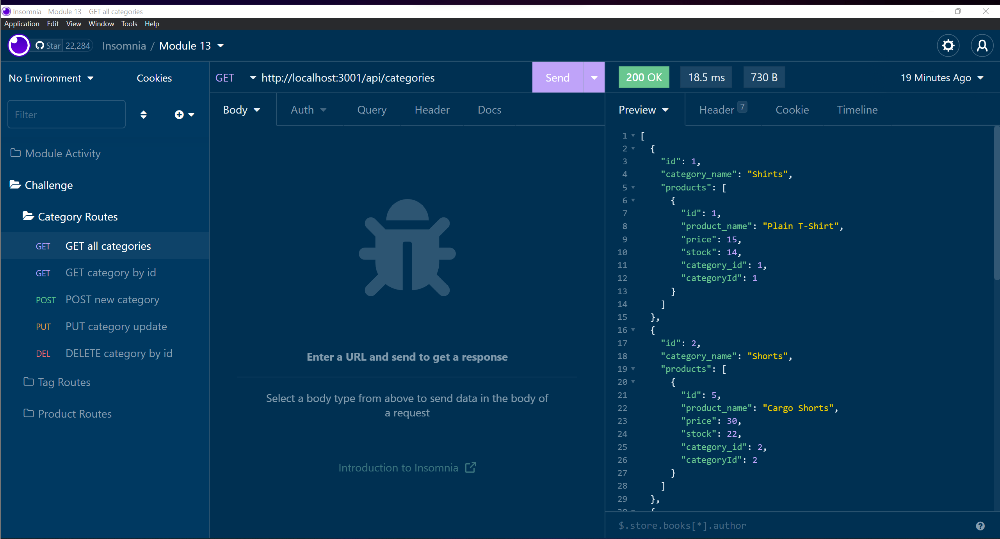

<h1 align='center'>

**E-Commerce Backend**

<!-- LICENSE BADGE -->

<!-- DEPENDENCIES BADGES -->

</h1>

This project is the backend for an e-commerce platform which includes a database and server. The database is managed using Sequelize which allows for the creation of tables and populating the database with data via JavaScript.

 
<h2 align='center'>

**Table of Contents**
</h2>

&nbsp;&nbsp;&nbsp;&nbsp;

 

### Usage
---
***Note***: You will need to have MySQL installed on your system in order to use this app.

***To install the Employee Tracker, use one of the following methods.***  
Method 1: Download

1. Download the zip file
2. Unzip the file into a new folder wherever you would like the application to live

Method 2: Clone

In the terminal:

    $ git clone git@github.com:devBritt/e-commerce-backend.git

 

**Once one of the above methods has been completed**, navigate to the application folder in your terminal and run `$ npm i` to install the required packages. You will then have to create and populate the database using the db.sql file provided. You can do this by executing the command `$ mysql -u 'username' -p`, replacing 'username' with the username you set when you installed MySQL. Input your password when prompted and use `$ source db/schema.sql` to create your database. To use the database, type `quit` in the MySQL shell to return to your terminal. There, you can use the included seed operation by typing the command `$ npm run seed` in your terminal. The last required step is to update the `.env.TEMPLATE` file. Change the file name to `.env` and update the username and password to reflect your MySQL user.

***Customization***
If you would like to use your own data, you can update the arrays in `category-seeds.js`, `product-seeds.js`, `product-tag-seeds.js` and `tag-seeds` in the seeds folder.

 

***To use the application, navigate to its root directory and run this command:***  
    
    $ node server

Congrats! You are now running the E-Commerce Backend!

 

### Demo
---
[E-Commerce Backend](https://youtu.be/VagjHg8LFsw)

 

### Lessons
---
This challenge was great for practicing SQL table associations and creating a REST API.
